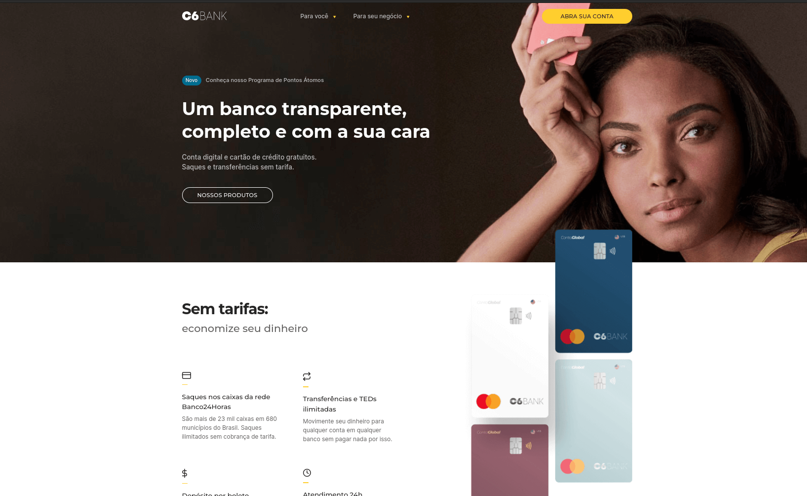

## Landing Page - Redesign C6Bank

- Link do projeto em produção: https://ander0308.github.io/c6bank-desafio/

## Tecnologias Utilizadas no projeto:
- HTML5
- Css com Sass
- Javascript
- Biblioteca Aos.js

  

## Observações.
- Desafio do curso Coodeboost - Ministrado pelo Will Moreira.
- Layout desenvolvido por @gilbertoprado.design
